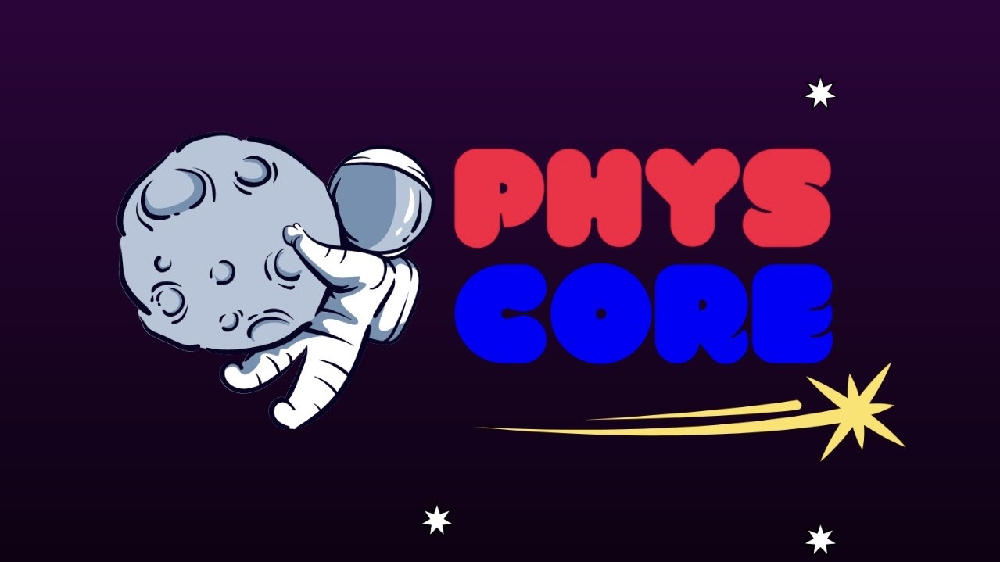

[![Issues][issues-shield]][issues-url]
[![Licença][license-shield]][license-url]

 

  

<h3 align="center">Site PhysCore</h3>

  

    Site do Projeto PhysCore: Visando a democratização da ciência para estudantes de todas as origens!
     
    <a href=""><strong>Acesse nosso Site »</strong></a>
     
     
    <a href="https://github.com/n1collass/PhysCore/issues/new?labels=bug&template=bug-report---.md">Delatar Problema</a>
    &middot;
    <a href="https://github.com/n1collass/PhysCore/issues/new?labels=enhancement&template=feature-request---.md">Fazer Sugestão</a>
  

## Sobre o Site

[![Product Name Screen Shot][product-screenshot]]()

Nosso site visa reunir todos as informações e conteudos de nosso projeto.

(<a href="#topo">retornar ao topo</a>)

### Construido com

* [![Vue][Vue.js]][Vue-url]
* [![Laravel][Laravel.com]][Laravel-url]
* [![JQuery][JQuery.com]][JQuery-url]

(<a href="#topo">retornar ao topo</a>)

## Próximas Atualizações

- [ ] Desenvolvimento do Backend
    - [ ] Painel de Controle
- [ ] Adicionar páginas informacionais

(<a href="#topo">retornar ao topo</a>)

## Contribuições

Nosso site é inteiramente construido pelos próprios membros do projeto.

(<a href="#topo">retornar ao topo</a>)

### Principais Contribuidores:

## Licença

Distribuido sobre a licença BSD 3-Clause. Veja `LICENSE` para mais informações.

(<a href="#topo">retornar ao topo</a>)

## Contato

Link do Projeto: [https://physcore.com.br](https://physcore.com.br)

(<a href="#topo">retornar ao topo</a>)

## Conquistas

* 
* 
* 

(<a href="#topo">retornar ao topo</a>)

<!-- MARKDOWN LINKS & IMAGES -->
<!-- https://www.markdownguide.org/basic-syntax/#reference-style-links -->
[contributors-shield]: https://img.shields.io/github/contributors/n1collass/PhysCore.svg?style=for-the-badge
[contributors-url]: https://github.com/n1collass/PhysCore/graphs/contributors
[forks-shield]: https://img.shields.io/github/forks/n1collass/PhysCore.svg?style=for-the-badge
[forks-url]: https://github.com/n1collass/PhysCore/network/members
[stars-shield]: https://img.shields.io/github/stars/n1collass/PhysCore.svg?style=for-the-badge
[stars-url]: https://github.com/n1collass/PhysCore/stargazers
[issues-shield]: https://img.shields.io/github/issues/n1collass/PhysCore.svg?style=for-the-badge
[issues-url]: https://github.com/n1collass/PhysCore/issues
[license-shield]: https://img.shields.io/github/license/n1collass/PhysCore.svg?style=for-the-badge
[license-url]: https://github.com/n1collass/PhysCore/blob/master/LICENSE
[linkedin-shield]: https://img.shields.io/badge/-LinkedIn-black.svg?style=for-the-badge&logo=linkedin&colorB=555
[linkedin-url]: https://linkedin.com/in/linkedin_username
[product-screenshot]: readme/screenshot.png
[Next.js]: https://img.shields.io/badge/next.js-000000?style=for-the-badge&logo=nextdotjs&logoColor=white
[Next-url]: https://nextjs.org/
[React.js]: https://img.shields.io/badge/React-20232A?style=for-the-badge&logo=react&logoColor=61DAFB
[React-url]: https://reactjs.org/
[Vue.js]: https://img.shields.io/badge/Vue.js-35495E?style=for-the-badge&logo=vuedotjs&logoColor=4FC08D
[Vue-url]: https://vuejs.org/
[Angular.io]: https://img.shields.io/badge/Angular-DD0031?style=for-the-badge&logo=angular&logoColor=white
[Angular-url]: https://angular.io/
[Svelte.dev]: https://img.shields.io/badge/Svelte-4A4A55?style=for-the-badge&logo=svelte&logoColor=FF3E00
[Svelte-url]: https://svelte.dev/
[Laravel.com]: https://img.shields.io/badge/Laravel-FF2D20?style=for-the-badge&logo=laravel&logoColor=white
[Laravel-url]: https://laravel.com
[Bootstrap.com]: https://img.shields.io/badge/Bootstrap-563D7C?style=for-the-badge&logo=bootstrap&logoColor=white
[Bootstrap-url]: https://getbootstrap.com
[JQuery.com]: https://img.shields.io/badge/jQuery-0769AD?style=for-the-badge&logo=jquery&logoColor=white
[JQuery-url]: https://jquery.com 